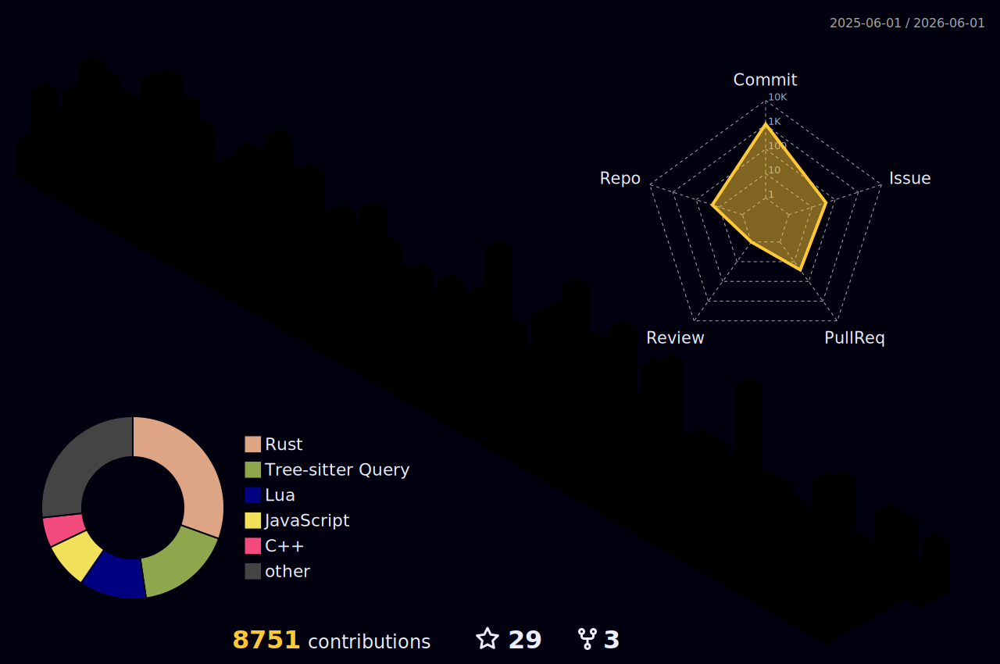

# アクゼスティア

### About

Tokyo, Japan

Systems, Networking && Graphics Engineer  
UI/UX Designer · 2D Artist

Salary expectations: high ^^

Principal Engineer & Head of R&D @ [wanime.io](https://github.com/TimeTo10X)

### Best Tools & Languages

 

-------

  
  ### Stats だよ ^_^

  
  

### Literature

- [x] C++ Concurrency in Action, by Anthony Williams
- [x] Designing Data-Intensive Applications: The Big Ideas Behind Reliable, Scalable, and Maintainable Systems, by Martin Kleppmann 

### Papers

- [MP-RDMA](https://www.microsoft.com/en-us/research/wp-content/uploads/2018/07/MP-RDMA-NSDI18.pdf)

### NVI<3M

- https://youtu.be/xE9W9Ghe4Jk?si=3k-J9H4Bd42PPAEE&t=291

// Github 89.99% uptime ? ^_^
