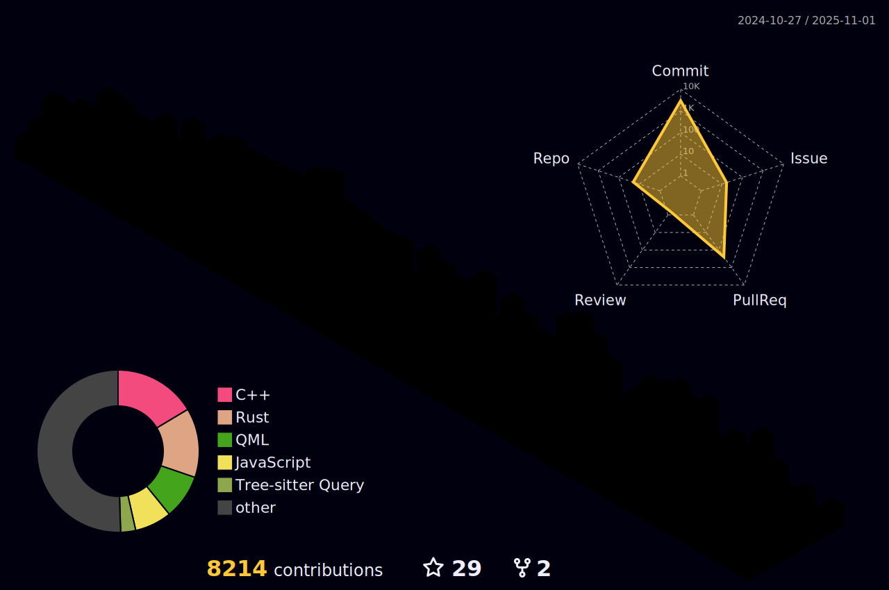

# アクゼスティア

### About 

Tokyo, Japan

Systems, Networking && Graphics Engineer  
UI/UX Designer · 2D Artist

### Best Tools & Languages

 

-------

  
  ### Stats だよ ^_^

  
  

### Literature

- [x] C++ Concurrency in Action, by Anthony Williams
- [x] Designing Data-Intensive Applications: The Big Ideas Behind Reliable, Scalable, and Maintainable Systems, by Martin Kleppmann 
